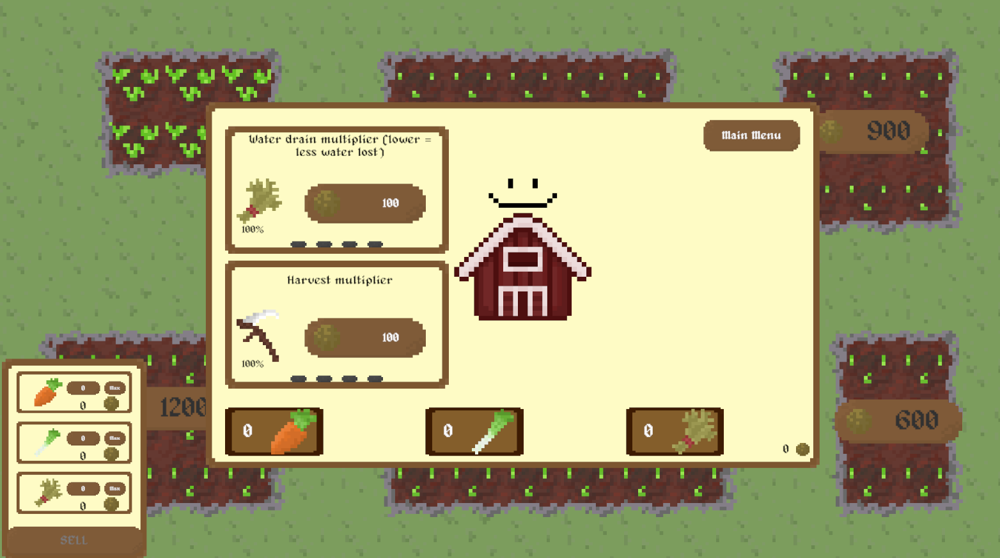

## Theme
Game made in a week for Rapid Games Prototyping Unit with the theme of 'Virtual Beings' and the optional modifier of being a 'cozy' game.
The player has to manage a series of farm plots which will lose water and grow weeds inhibiting growth. The player can then harvest crops
to then sell to gain improved harvesting multipliers and reduce water drain. The 'Virtual Being' part of the game is implemented as a virtual
manager which will tell the player where any issues are occurring such as a plot that is running low on water or has weeds and will highlight
the effected crop plot. The player has a series of tools to interact with: a scythe for harvesting, a watering can for watering and cutters
for removing weeds.

## Controls
1, 2, 3 cycles tool (Scythe, Watering Can, Cutters respectively)
Tab opens/closes manager (Esc will also close)

## Screenshot

## Assets Used
- Harvest sound: (https://pixabay.com/sound-effects/mowing-with-a-scythe-74100/)
- Watering: (https://pixabay.com/sound-effects/watering-with-a-watering-can-39121/)
- Weeding: (https://pixabay.com/sound-effects/box-cutter-in-and-out-64627/)
- BGM : (https://www.incompetech.com/music/royalty-free/mp3-royaltyfree/Morning.mp3)
